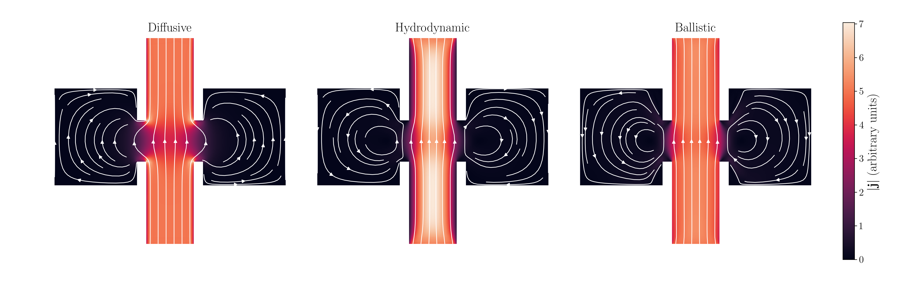

<p align="center">
  
</p>

<h1 align="center">FermiSea.jl</h1>

<p align="center">
  <a href="https://jackhfarrell.github.io/FermiSea.jl/">
    
  </a>
  <a href="https://doi.org/10.5281/zenodo.19899547">
    
  </a>
</p>

FermiSea.jl simulates 2D electron transport, hydrodynamic and otherwise, in arbitrary device geometries in the Julia programming language. Currently we solve a linear Boltzmann equation with a circular Fermi surface and phenomenological collision terms. The spatial discretization is provided by [`Trixi.jl`](https://trixi-framework.github.io/TrixiDocumentation/stable/), a library for high-order finite volume and discontinuous Galerkin methods.



Find a short tutorial [here](https://jackhfarrell.com/FermiSea.jl/tutorials/).

## Citation
If desired, feel free to refer to this code directly as follows:

```bibtex
@software{farrell_fermisea_2026,
  author = {Farrell, Jack H.},
  title = {FermiSea.jl},
  version = {v0.1.0},
  doi = {10.5281/zenodo.19899547},
  url = {https://github.com/jackhfarrell/FermiSea.jl/tree/v0.1.0},
  year = {2026}
}
```

## Used in

- Ludwig Holleis, Youngjoon Choi, Canxun Zhang, Jack H. Farrell, Gabriel Bargas,
Audrey Hsu, Zexing Chen, Ian Sackin, Wenjie Zhou, Yi Guo, Thibault Charpentier,
Yifan Jiang, Benjamin A. Foutty, Aidan Keough, Martin E. Huber, Takashi
Taniguchi, Kenji Watanabe, Andrew Lucas, and Andrea F. Young. “Cryogenic shock
exfoliation for ultrahigh mobility rhombohedral graphite nanoelectronics”,
[arXiv: 2604.21912 (2026)](https://arxiv.org/abs/2604.21912).

- Canxun Zhang, Evgeny Redekop, Hari Stoyanov, Jack H. Farrell, Sunghoon Kim,
Ludwig Holleis, David Gong, Yongjoon Choi, Takashi Taniguchi, Kenji Watanabe,
Martin E. Huber, Ania C. Bleszynski Jayich, Andrew Lucas, and Andrea F. Young.
“Imaging electron hydrodynamics in a graphene flat band system”,
[arXiv: 2603.11175 (2026)](https://arxiv.org/abs/2603.11175).
