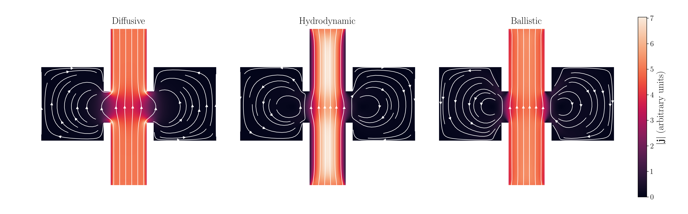

<h1> FermiSea.jl</h1>

FermiSea.jl solves the steady linear Boltzmann equation for electron transport in
two-dimensional devices. For now, we work with one circular Fermi surface at zero
temperature and use toy two-rate approximations to the collision integral.



## Quickstart

First, install `FermiSea`, along with `Trixi` for the spatial discretization and
`CairoMakie` for plotting:

```julia
using Pkg
Pkg.add(["FermiSea", "Trixi", "CairoMakie"])
```

Now let's drive a small rectangle from left to right, using Trixi's `TreeMesh`.
Reservoirs set energy departures of `+0.1` and `-0.1`, and the top and bottom are
diffuse walls. We choose fast momentum-conserving collisions and weak momentum
relaxation.

```julia
using FermiSea, Trixi, CairoMakie

surface = circular_fermi_surface(; p_fermi = 1.0, v_fermi = 1.0,
                              nangle = 16, charge = -1.0, spin_degeneracy = 1)
model = BoltzmannEquation(surface)
mesh = TreeMesh((-0.5, -0.5), (0.5, 0.5);
                initial_refinement_level = 3, n_cells_max = 100,
                periodicity = false)
boundaries = (; x_neg = FixedReservoir(0.1), x_pos = FixedReservoir(-0.1),
                y_neg = DiffuseWall(), y_pos = DiffuseWall())
collision = Callaway(model; gamma_mr = 0.01, gamma_mc = 20.0)
problem = BoltzmannProblem(model, mesh, boundaries;
                           source_terms = collision, degree = 2)
solution = solve(problem; tolerance = 1e-9)

contact_particle_flux(solution, :x_pos)

figure = plot(solution, particle_current)
streamplot!(content(figure[1, 1]), solution, particle_current;
            color = _ -> :black, linewidth = 1, gridsize = (16, 16), density = 0.5)
content(figure[1, 2]).label = "|particle current| (model units)"
figure
```

## Citation

If you find this code useful, please cite our
[theory paper](https://arxiv.org/abs/2605.03030):

```bibtex
@misc{farrell2026characterizing,
  author = {Farrell, Jack H. and Lucas, Andrew},
  title = {Characterizing electronic scattering rates with transport in multiterminal devices},
  year = {2026},
  eprint = {2605.03030},
  archivePrefix = {arXiv},
  primaryClass = {cond-mat.mes-hall},
  url = {https://arxiv.org/abs/2605.03030}
}
```

To cite the software directly:

```bibtex
@software{farrell2026FermiSea,
  author = {Farrell, Jack H.},
  title = {FermiSea.jl},
  version = {0.2.0},
  year = {2026},
  url = {https://github.com/jackhfarrell/FermiSea.jl}
}
```

We use `Trixi` for the spatial discretization. Please also cite its original
papers: [Ranocha et al. (2022)](https://arxiv.org/abs/2108.06476) and
[Schlottke-Lakemper et al. (2021)](https://arxiv.org/abs/2008.10593).

<details>
<summary>Trixi.jl BibTeX</summary>

```bibtex
@article{ranocha2022adaptive,
  title = {Adaptive numerical simulations with {T}rixi.jl:
           {A} case study of {J}ulia for scientific computing},
  author = {Ranocha, Hendrik and Schlottke-Lakemper, Michael and Winters, Andrew R.
            and Faulhaber, Erik and Chan, Jesse and Gassner, Gregor J.},
  journal = {Proceedings of the JuliaCon Conferences},
  volume = {1},
  number = {1},
  pages = {77},
  year = {2022},
  doi = {10.21105/jcon.00077}
}

@article{schlottkelakemper2021purely,
  title = {A purely hyperbolic discontinuous {G}alerkin approach for
           self-gravitating gas dynamics},
  author = {Schlottke-Lakemper, Michael and Winters, Andrew R.
            and Ranocha, Hendrik and Gassner, Gregor J.},
  journal = {Journal of Computational Physics},
  volume = {442},
  pages = {110467},
  year = {2021},
  doi = {10.1016/j.jcp.2021.110467}
}
```

</details>

## Research using FermiSea

- Jack H. Farrell and Andrew Lucas. “Characterizing electronic scattering rates
  with transport in multiterminal devices.” [arXiv:2605.03030 (2026)](https://arxiv.org/abs/2605.03030).

- Ludwig Holleis, Youngjoon Choi, Canxun Zhang, Jack H. Farrell, Gabriel Bargas,
  Audrey Hsu, Zexing Chen, Ian Sackin, Wenjie Zhou, Yi Guo, Thibault Charpentier,
  Yifan Jiang, Benjamin A. Foutty, Aidan Keough, Martin E. Huber, Takashi Taniguchi,
  Kenji Watanabe, Andrew Lucas, and Andrea F. Young. “Cryogenic shock exfoliation
  for ultrahigh mobility rhombohedral graphite nanoelectronics.”
  [arXiv:2604.21912 (2026)](https://arxiv.org/abs/2604.21912).

- Canxun Zhang, Evgeny Redekop, Hari Stoyanov, Jack H. Farrell, Sunghoon Kim,
  Ludwig Holleis, David Gong, Aidan Keough, Youngjoon Choi, Takashi Taniguchi,
  Kenji Watanabe, Martin E. Huber, Ania C. Bleszynski Jayich, Andrew Lucas, and
  Andrea F. Young. “Imaging flat band electron hydrodynamics in biased bilayer
  graphene.” [arXiv:2603.11175 (2026)](https://arxiv.org/abs/2603.11175).
