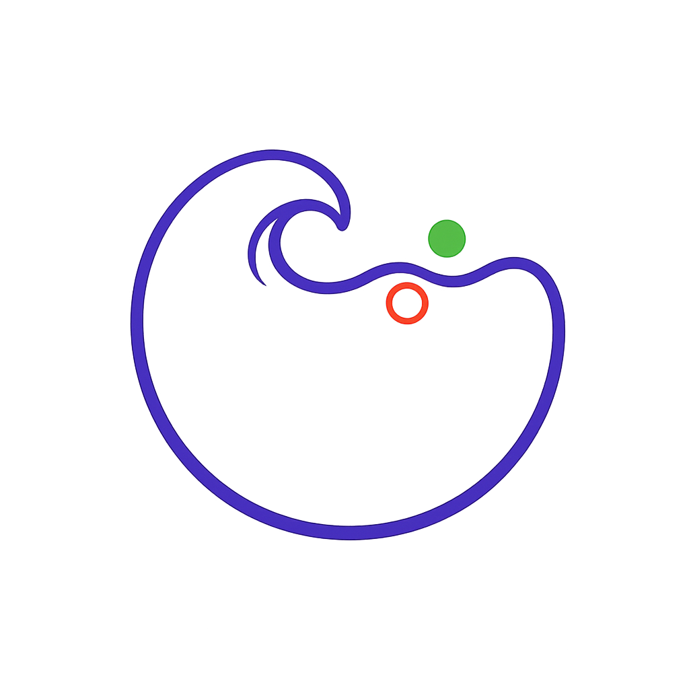

```@raw html
<div style="display:flex;align-items:center;gap:0.9rem;margin-bottom:1.2rem;">
  
  <h1 style="margin:0;">FermiSea.jl</h1>
</div>
```

FermiSea.jl is code to simulate 2D electron transport, hydrodynamic and otherwise, in arbitrary device geometries. The package provides equation types, source terms, boundary conditions, analysis
callbacks, and HDF5 output helpers for workflows that combine transport physics
with high-order discontinuous Galerkin methods.


## Docs

The tutorials section is the best starting point for setup and worked examples.

- [Tutorials](tutorials/index.md)
- [Reference](reference/index.md)

## Package Contents

- `IsotropicFermiHarmonics2D` equations for harmonic expansions of the angular
  distribution.
- Collision and magnetic-field source terms that plug into Trixi
  semidiscretizations.
- Contact and wall boundary conditions for current-driven and probe-style
  simulations.
- Steady-state diagnostics and HDF5 export utilities for visualization.
