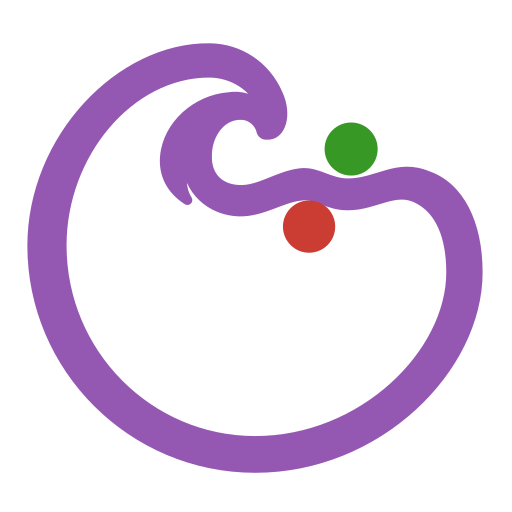

# [FermiSea.jl](@id FermiSea.jl)

FermiSea.jl solves the steady linear Boltzmann equation for electron transport in
two-dimensional devices. For now, we work with one circular Fermi surface at zero
temperature and use toy two-rate approximations to the collision integral.

## Installation

FermiSea.jl `0.2.0` requires Julia 1.12. Install from the Julia registry.
We use `Trixi` for the mesh and spatial discretization and `CairoMakie` for plotting.

```julia
using Pkg
Pkg.add(["FermiSea", "Trixi", "CairoMakie"])
```

## Reading the docs

The [model page](@ref model-conventions) gives the equations, signs, and units.
The [square-bells tutorial](@ref square-bells) solves and plots hydrodynamic flow on
an included unstructured mesh.

[Solving](@ref solving) explains convergence checks and how to use a previous
solution as an initial guess. [Currents and saved results](@ref analysis) covers
sampling, plotting, and saving results. The [API reference](@ref api) lists the
public functions and their arguments.

## Tests

```julia
using Pkg
Pkg.test("FermiSea")
```

## License

FermiSea.jl is available under the [MIT license](https://github.com/jackhfarrell/FermiSea.jl/blob/main/LICENSE).
